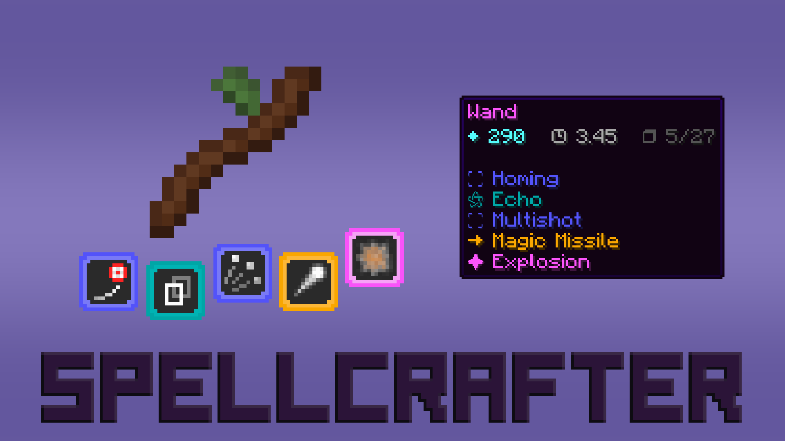
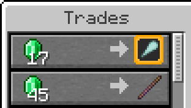
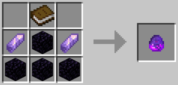
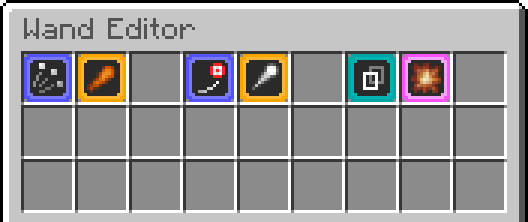
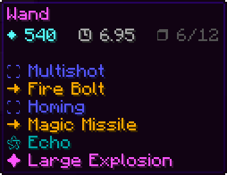
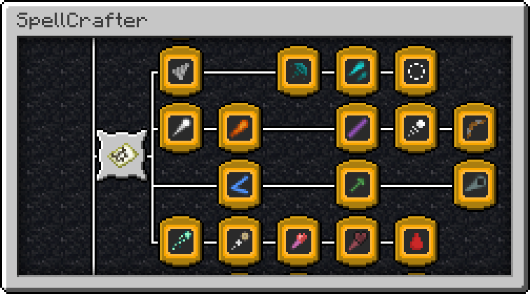
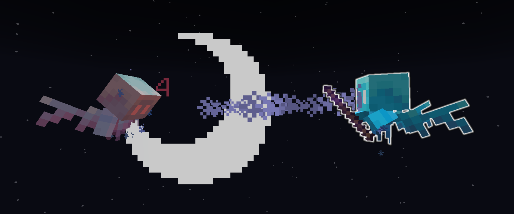
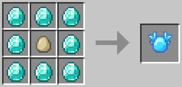

# SpellCrafter

SpellCrafter is a Minecraft data pack adds over 100 unique spells you can combine in endless ways! Inspired by _Noita_, this system lets you craft your own magic, discover rare spells, and create powerful combinations.

<br>

> **Note** \
> This project is currently in its alpha stage - you may encounter bugs and unbalanced features. The `1.0.0` release will introduce new spells, textures and system improvements. You can contribute here (by creating an issue or pull request) or join the Discord server.

<br>

<p align="center">
  
</p>


<h3 align="center">
  <a href="https://discord.gg/QAtc7ZgPxS">Discord</a> | 
  <a href="https://www.planetminecraft.com/data-pack/spellcrafter/">PlanetMinecraft</a> |
  <a href="https://modrinth.com/project/spellcrafter">Modrinth</a> |
  <a href="https://www.youtube.com/watch?v=tMNynL_ZzsY">YouTube</a>
</h3>

Using the resource pack isn't required, but it's highly recommended. You can find it in the [Releases Page](https://github.com/Ivaynn/SpellCrafter/releases) or in the Modrinth and PlanetMinecraft links above.


<br>

## Installation

- Download the [Latest Release](https://github.com/Ivaynn/SpellCrafter/releases/latest)

- Install the data pack in your world

- Install the resource pack (optional, but highly recommended)

- Use `/trigger SpellCrafter` to check your installation


<br>

## Getting Started


### 1. Find or spawn a Mystic Merchant

These traders can spawn naturally, or you can spawn one:

```
/loot give @s loot spellcrafter:egg/trader
```


### 2. Buy a wand and some spells

Each trader offers a unique, randomly generated selection of spells and wands.



### 3. Craft and place a Wand Editor

| Wand Editor Recipe | Items |
| -- | -- |
|  | 4 Obsidian <br/> 2 Amethyst Shards <br/> 1 Book

```
/loot give @s loot spellcrafter:egg/table
```


### 4. Open the editor while holding your wand

Here, you can edit the spells of your wand. Put spells in this menu to add them to your wand.




### 5. Save and shoot your wand

Exit the Wand Editor to save the spells to your wand. You can check the item's description to see the spell list, mana cost, cooldown and available slots.




<br>

## Spells


**→** | Projectile
\
Spells that shoot a projectile. They usually travel in a straight line and deal damage when they hit something, but this can be modified by other spells. The spell list continues where the projectile ends.


**⛶** | Modifier
\
Spells that modify a projectile. These can be stacked and completely change how the projectile behaves. They can change its damage, range, speed, trajectory, appearance, ...


**✦** | Instant
\
Spells that get cast instantly and cannot be modified. These can summon entities, protect you, create explosions, teleport entities, create shields, affect nearby projectiles, ...


**⚝** | Special
\
Spells that affect the wand in unique ways and don't fit any of the other categories. These can modify the wand properties, change spell order, copy other spells, ...


<br>

## Advancements

You can use advancements to track your progress! Find new spells to expand your collection:




<br>

## Target Dummy

Target dummies can be used to test your wands. They display the damage taken and they can even use a wand if you give them one. To remove the dummy, give it an egg or another target dummy's spawn egg.




| Target Dummy Recipe | Items |
| -- | -- |
|  | 8 Diamonds <br/> 1 Egg

```
/loot give @s loot spellcrafter:egg/dummy
```


<br>

## Mystic Merchant

This wandering trader spawns wearing a magical hat. Their random spawns are linked to players, so you're more likely to see them on servers with other people.

They sell a random selection of spells and a few wands that already have some spells in them. They can also sell their hat and mana cookies, used to permanently increase the player's mana.

Mystic Merchants can be spawned with their egg (only obtainable with commands):

```
/loot give @s loot spellcrafter:egg/trader
```


<br>

## Enemies

Most human-shaped mobs can also be spawned holding a randomly generated wand.

```
/loot give @s loot spellcrafter:egg/mob/husk
/loot give @s loot spellcrafter:egg/mob/zombie_villager
/loot give @s loot spellcrafter:egg/mob/stray
/loot give @s loot spellcrafter:egg/mob/vindicator
/loot give @s loot spellcrafter:egg/mob/wither_skeleton
```

These enemies always drop their wand when killed. Each mob type has a fixed "Tier" which controls their mana and how strong their spells and wands can be.


<br>

## Admin Tools

### Datapack Options
An interactive options menu, used to toggle certain features.
```
/function spellcrafter:admin/options
```


### Infinite Mana
Disable mana restrictions when casting a spell (toggle).
```
/function spellcrafter:admin/infinite_mana
```


### No Cooldown
Disable cooldown restrictions when casting a spell (toggle).
```
/function spellcrafter:admin/no_cooldown
```


### Untargetable
Become untargetable by spells (toggle).
```
/function spellcrafter:admin/untargetable
```


### Spells Menu
Replaces your inventory with a menu containing all spells and a wand builder (toggle).

```
/function spellcrafter:admin/spells_menu
```
Disables the collection advancements while enabled.


<br>

## Compatibility Notes

- Made for Minecraft Java Edition 1.21.8
- Everything uses the `spellcrafter` namespace/prefix


<br>

## Contributing

Found a bug? Have a suggestion? Join the [Discord](https://discord.gg/QAtc7ZgPxS) or create an [Issue](https://github.com/Ivaynn/SpellCrafter/issues)!


<br>

## License
MIT license, check [LICENSE](./LICENSE) for more details.
